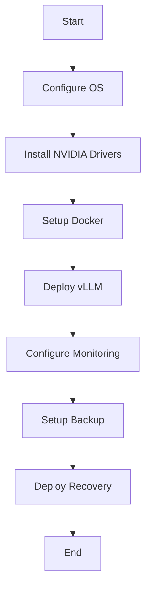
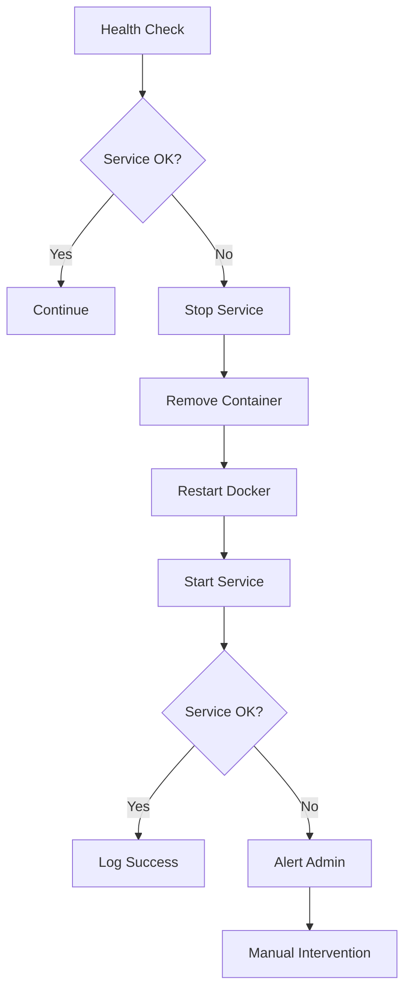

# Inference Infrastructure Architecture

This document provides an overview of the Inference Infrastructure architecture, explaining how all components fit together to create a robust, scalable, and maintainable platform.

## System Architecture


The system is designed with the following layers:

1. **Hardware Layer**: Physical Debian servers with NVIDIA GPUs
2. **OS Layer**: Debian Linux with NVIDIA drivers and CUDA
3. **Container Layer**: Docker with NVIDIA container runtime
4. **Application Layer**: vLLM inference server
5. **Management Layer**: Ansible automation

## Component Breakdown

### 1. Base Infrastructure

- **OS**: Debian 12 (bookworm)
- **Drivers**: NVIDIA drivers with CUDA support
- **Configuration**: Custom APT sources, system packages, security settings

### 2. Docker Environment

- **Docker Engine**: Docker CE with NVIDIA container runtime
- **Runtime Configuration**: GPU passthrough, resource limits, networking

### 3. vLLM Inference Server

- **Container**: vLLM Docker container
- **Configuration**: Model selection, context length, memory utilization
- **Service Management**: Systemd service for automatic startup/recovery

### 4. Monitoring System

- **Metrics Collection**: Node exporter, custom exporters for GPU and vLLM metrics
- **Data Format**: Prometheus-compatible metrics
- **Health Checks**: Automated service health verification

### 5. Recovery System

- **Health Checks**: Regular verification of vLLM service
- **Auto-Recovery**: Automatic service restart and configuration repair
- **Manual Recovery**: Tools for administrator-initiated recovery procedures

### 6. Backup System

- **Configuration Backups**: Regular backups of critical configuration files
- **Log Management**: Log rotation and archiving
- **Retention Policy**: Configurable backup retention

### 7. Management Interface

- **Ansible Control**: Centralized management with Ansible
- **Playbooks**: Task-specific automation scripts
- **Inventory**: Dynamic infrastructure definition

## Automation Structure

The automation is organized into the following structure:

```
ansible/
├── ansible.cfg             # Ansible configuration
├── group_vars/             # Variable definitions
│   └── all.yml             # Global variables
├── inventory.yml           # Node inventory
├── master.yml              # Main entry point
├── playbooks/              # Task-specific playbooks
│   ├── backup.yml          # Backup system setup
│   ├── maintenance.yml     # Routine maintenance tasks
│   ├── monitoring.yml      # Monitoring setup
│   ├── recovery.yml        # Recovery system setup
│   └── update-model.yml    # Model update procedure
├── roles/                  # Ansible roles
│   ├── backup/             # Backup system role
│   ├── common/             # Common setup role
│   ├── docker_setup/       # Docker installation role
│   ├── monitoring/         # Monitoring setup role
│   ├── nvidia_setup/       # NVIDIA drivers role
│   ├── recovery/           # Recovery system role
│   └── vllm_setup/         # vLLM deployment role
├── site.yml                # Base deployment playbook
└── templates/              # Configuration templates
```

## Workflow Diagrams

### Deployment Workflow



### Recovery Workflow



## Security Considerations

The infrastructure includes several security measures:

1. **Custom APT Sources**: Using internal package repositories
2. **Limited User Permissions**: Principle of least privilege
3. **Container Isolation**: Workloads run in containers
4. **Network Security**: Limited port exposure
5. **SSH Key Authentication**: No password-based SSH

## Scaling Considerations

The system can be scaled in multiple ways:

1. **Horizontal Scaling**: Add more inference nodes
2. **Vertical GPU Scaling**: Add more GPUs to existing nodes
3. **Model Distribution**: Different models on different nodes
4. **Tensor Parallelism**: Split large models across multiple GPUs

## Performance Optimization

Performance is optimized through:

1. **GPU Memory Utilization**: Configurable memory allocation
2. **Tensor Parallelism**: Efficient multi-GPU utilization
3. **Container Resource Limits**: Proper resource allocation
4. **Health Monitoring**: Proactive issue detection

## Maintenance Procedures

Regular maintenance includes:

1. **System Updates**: Routine security and package updates
2. **Resource Cleanup**: Docker image and container cleanup
3. **Log Rotation**: Prevent disk space issues
4. **Health Verification**: Regular service checks

## Operational Best Practices

For optimal operation:

1. **Regular Backups**: Ensure the backup system is functioning
2. **Monitoring Setup**: Connect to a Prometheus server
3. **Update Testing**: Test model updates on one node before rolling out
4. **Resource Planning**: Monitor GPU utilization for capacity planning
